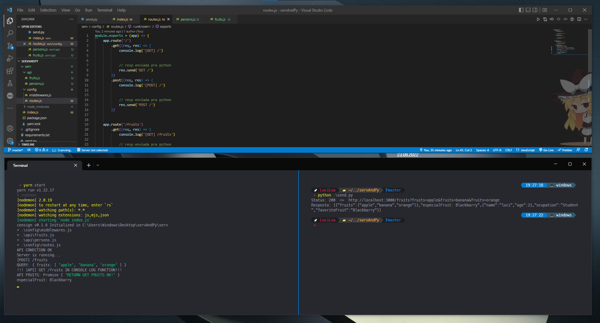

## 🌟 Py+Node Conection [_!TEST REPO!_]

###### Connect Python with a server in node JS using Express as backend framework

---

### 🟢 node dependencies:

- nodemon

- consign

- express

- body-parser

- cors

### 🐍 python module:

- requests

## Preview
